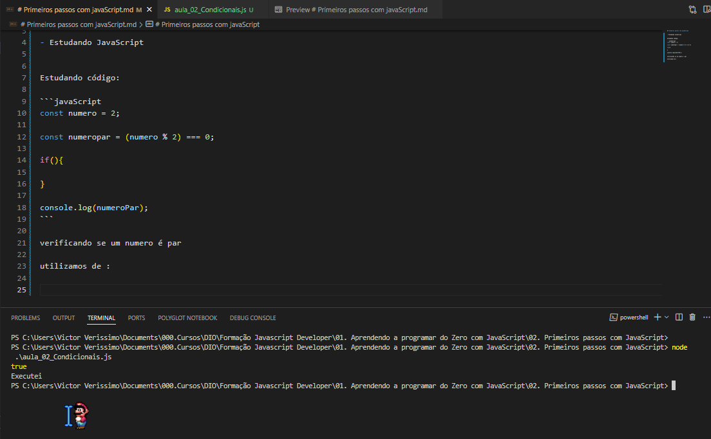

# Primeiros passos com javaScript


- Estudando JavaScript


Estudando código:

```javaScript
const numero = 2;

const numeropar = (numero % 2) === 0;

if(){

}

console.log(numeroPar);
```

verificando se um numero é par

utilizamos de :

